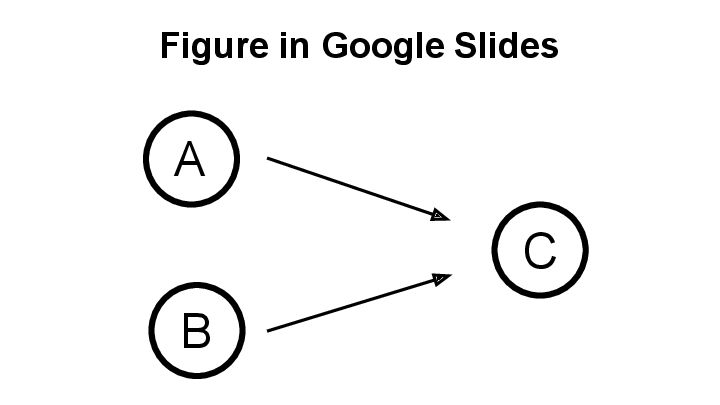

# slides-test
Google slidesに作ったポンチ絵をGitHubのMarkdownにTravisで自動的にコミットする。
pngにdiffがなかったときの挙動は...？

# 参考文献
- TravisからGitHubにコミット: http://rcmdnk.github.io/blog/2014/10/09/computer-github-travisci/#section
